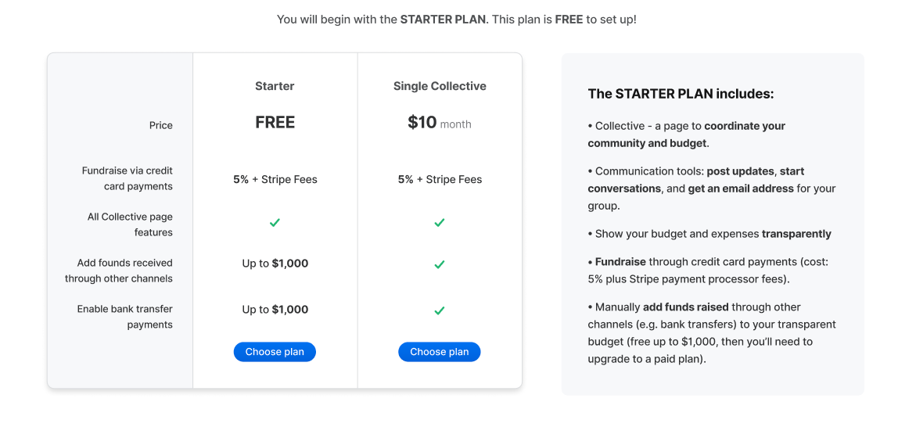
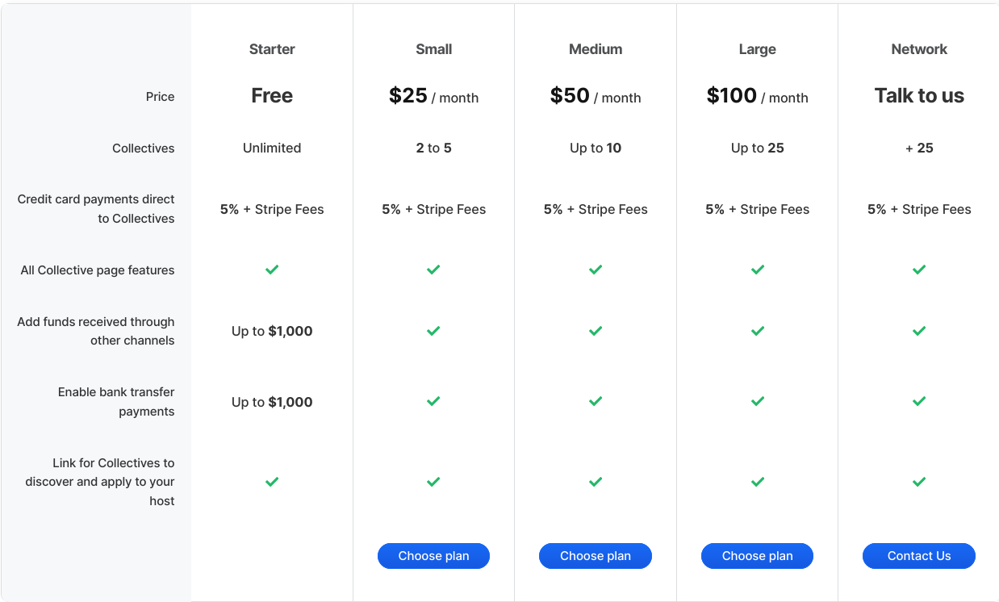

# Pricing

**Setting up a Collective is free, but there are fees to accept and pay out money.**

_If you are a..._

### Single Collective with a bank account where you want to hold your funds.

If you are a **single Collective** and **have a bank account** to receive money for your group or project, this will be your plan. The bank account can be someone's personal account or that of a company.

If you just want to receive credit card contributions to your budget,  \(via Stripe\), the fees are 5% + Stripe fees. 

You can also choose to receive funds directly to your bank account, or through other channels such as cash, another payment or fundraising app, a ticket sales platform, etc. This is free up to $1,000, then costs $10/month. 

### Single Collective without a bank account where you want to hold your funds.

If you are **single Collective** and **don't have a bank account to hold your funds,** you need to apply to a Fiscal Host. Fiscal Hosts are organizations that provide fundholding services, handle taxes and liability, and take a lot of the pain out of receiving and spending funds. 

If you join a Fiscal Host, you don't have to pay Open Collective directly, because your Fiscal Host pays for use of the platform. Most Hosts charge a fee to Collectives for the services they provide, but each one is autonomous so these fees vary. 

Check out some [Fiscal Hosts](../fiscal-hosts/fiscal-hosts.md).

### An Organization that wants to create multiple Collectives.

You are a Fiscal Host, which is an entity that holds funds on behalf of multiple Collectives. Your plan will depend on how many Collectives you host, as well as your payments options.

If you just want to receive money via credit card payments \(using Stripe\), the fees are 5% + Stripe Fees. 

You can also choose to receive funds directly to your bank account, or through other channels such as cash, another payment or fundraising app, a ticket sales platform, etc. This is free up to $1,000. After that limit, you'll need a paid plan according to the number of Collectives you host. 

### What is a Fiscal Host?

A fiscal host is a legal company or individual who enables financial transactions, holds funds, and takes care of liability and taxes for a Collective. Fiscal Hosts make it possible for Collectives to transact without incorporating their own legal entity. Each Fiscal Host sets its own fees, most commonly 0% and 5%.

[More info about Fiscal Hosts](../fiscal-hosts/fiscal-hosts.md)

