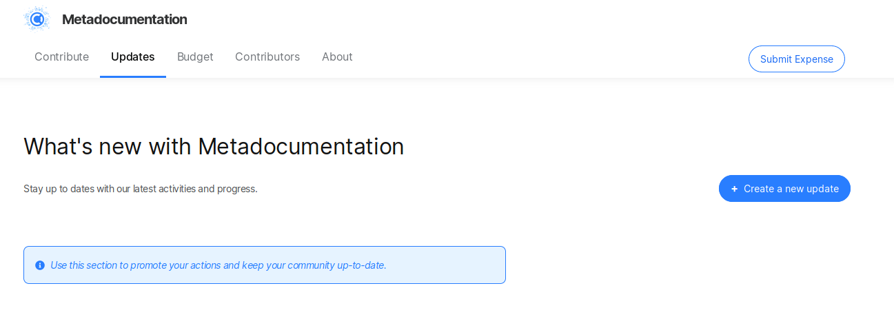
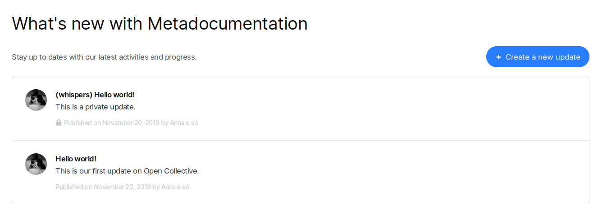
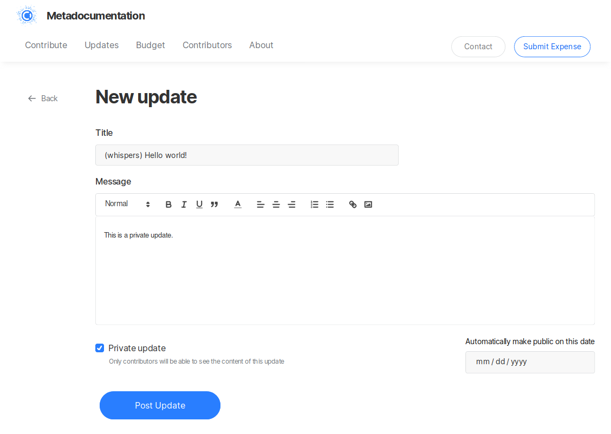
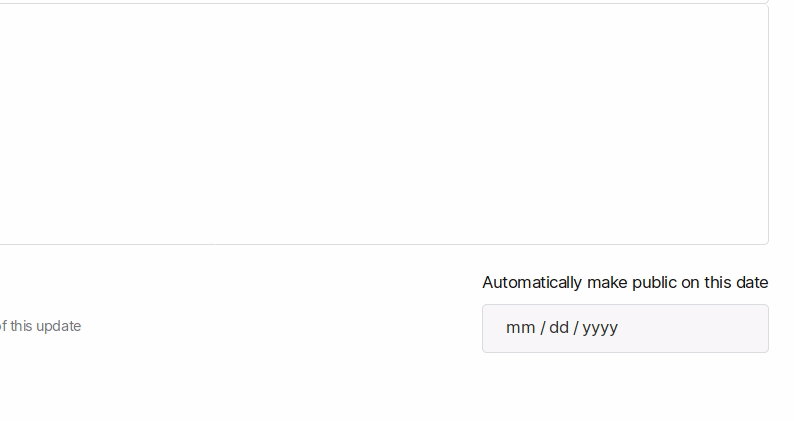

# Updates & Comms

## Updates

A lot of Collectives like to periodically email their Financial Contributors, to let them know what their donations are enabling, express thanks, or notify everyone of a change. Similarly, hosts often need to contact the administrators of the Collectives they are hosting.

To create an Update, go to your Collective page, head to the **Updates** section and click on **+ Create a new update**. Updates will be emailed and appear in the Updates section of your Collective page.

#### Target audience

If you're a fiscal host, you'll have the option to pick the target audience before publishing an update:

* **Notify financial contributors**: will notify everyone who financially contributed to the host
* **Notify hosted collective's admins**: the administrators of the Collectives you're hosting
* **Notify everyone**: will notify the two categories above 


You can also write and publish Updates through email by sending a message to **backers@`$COLLECTIVE`.opencollective.com** \(in which `$COLLECTIVE` is the slug of your Collective, which appears in your Collective URL\).


### Web interface

We offer a rich editor to write your fantastic updates to your Contributors!

#### Private updates


Hosts don't have access to the "private updates" feature yet.


You can also write and publish exclusive updates for your Contributors by selecting the box on **Private update**.

And if you wish, you can set it to become public after a certain date.

## Contacting a Collective

Users can contact you via the contact form of your collective. It is linked in your collective page through the `Contact` button. The forms stands on `/{your-collective}/contact`. If you don't want to use this feature, please contact us at [https://opencollective.com/support](https://opencollective.com/support) and we'll disable it for you.

