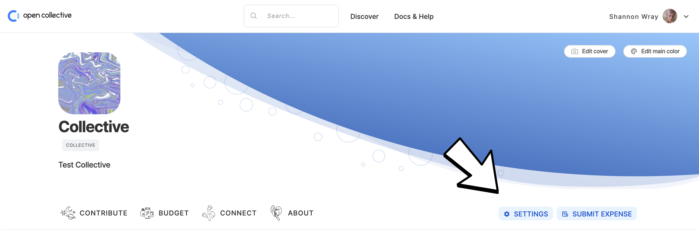
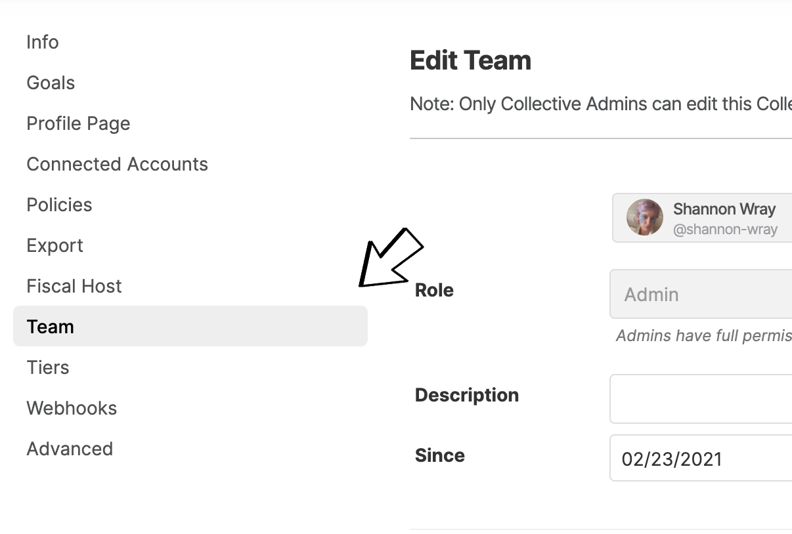
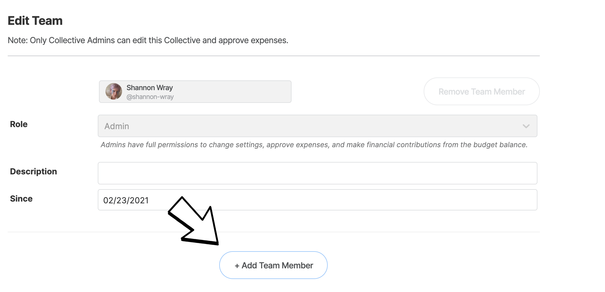
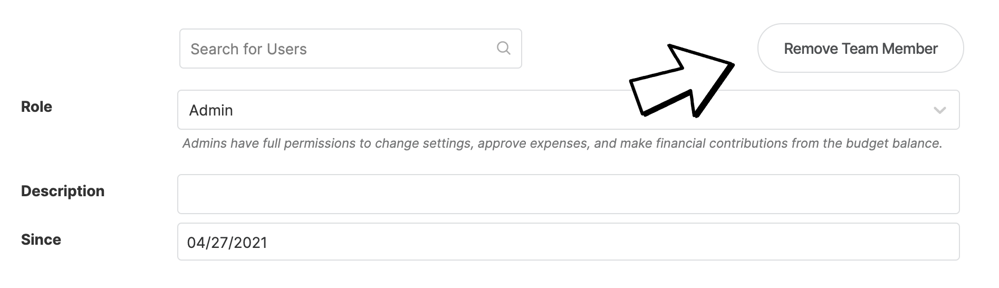

# Team

## Roles

**Admins** have full permissions to change settings, approve expenses, and make financial contributions from the budget balance.

**Core contributors** show up in the Team section of your page and can create events, but can't change settings or approve expenses.

**Accountants** can access financial information, such as receipts, invoices, and reports. They can't change settings or approve expenses.

## Adding, Editing and Removing team members

1. Go to your Collective page and click the gear next to your Collective logo.

2. Head to the **Team** tab. Here you can add, remove, or change people and roles. 

3. Click the Add Team Member button 


Only **Admins** can edit the Collective and approve expenses. Be sure to select the right role option.


4. Once you are done, click on **Save** at the bottom of the page.

5. Users will receive an invite to join the Collective. They will not be displayed publicly until this invitation is accepted.

6. To remove a Team Member click the Remove Team Member button next to the corresponding user. 

## Re-send email invitations

If someone indicates that they didn't receive an invitation email, the first thing to do is for them to search for the keywords "Invitation to join" in the target inbox, including in the spam folder.  
  
If they still can't find them, the easiest way to re-trigger the emails is:

1. Go to the settings page of the Collective &gt; Core contributors section
2. Remove the concerned users
3. Click on Save
4. ​Click on "Add core contributor" and add them again \(you should be able to search by pasting user emails in the search box\) 

