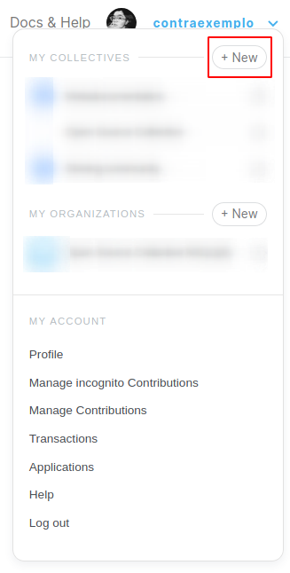
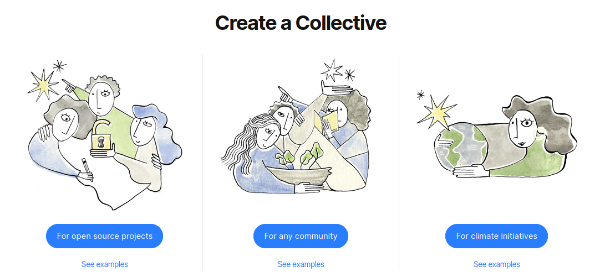
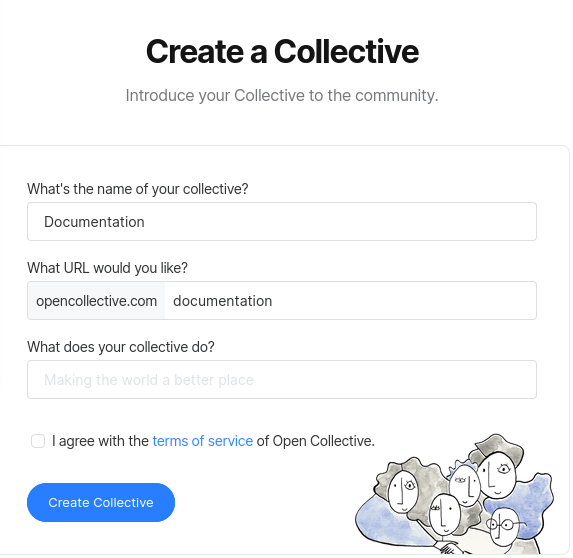

# Creating a Collective

Open Collective allows you to create a transparent funding page for your project in just a few clicks. No need to incorporate, hire a lawyer and accountant, or define organizational roles!

Once you've registered on Open Collective, reveal the dropdown menu by clicking on your username, then click on the **+ New** button under the **My Collectives** section.

Then, select the category that best describe your Collective.

If you are not creating an open source Collective, you will be immediately directed to a Collective creation form, where you will be asked for your **Collective name**, **URL slug** of choice, and a **brief description** of your Collective's activities. 

If you are creating a Collective for an **open source project**, you will be directed to a verification process to join the Open Source Collective fiscal host. [More info about that here](osc-verification.md).

