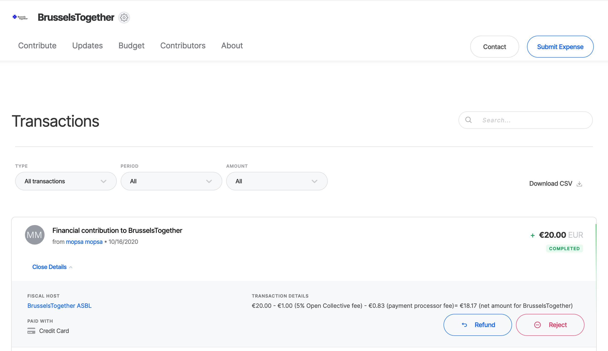
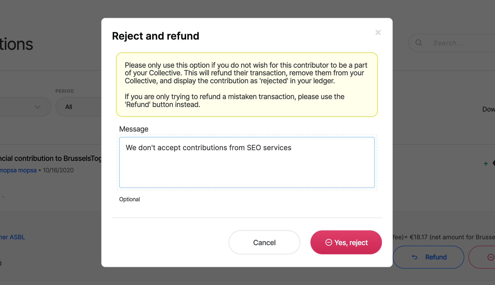
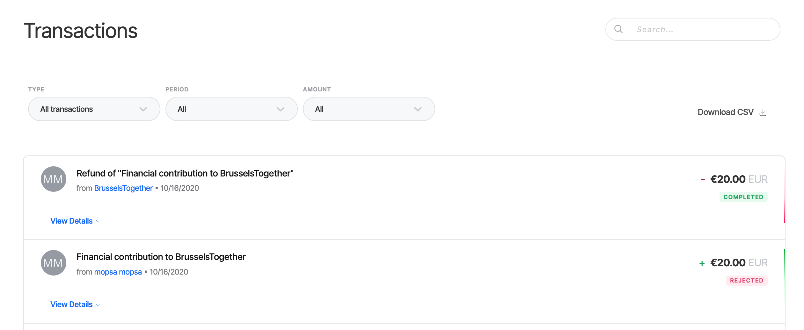
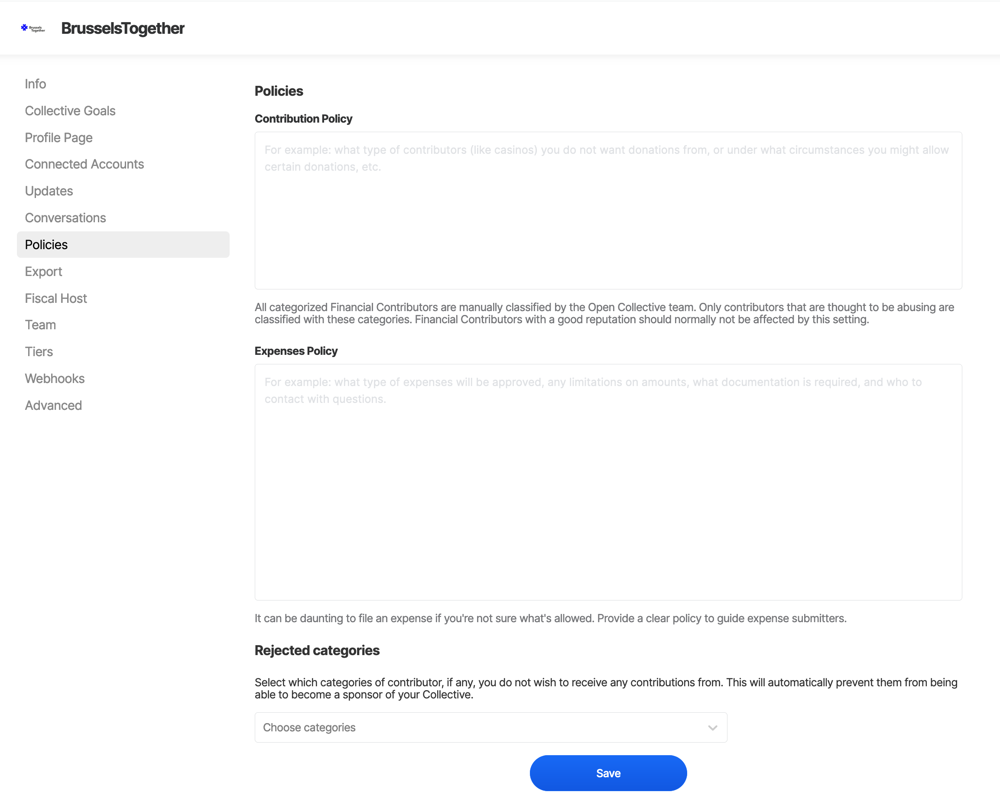
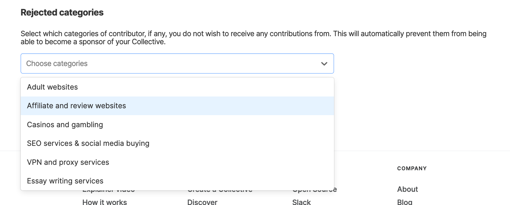
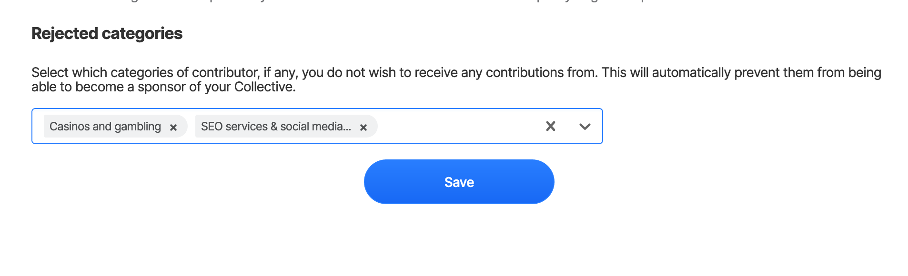
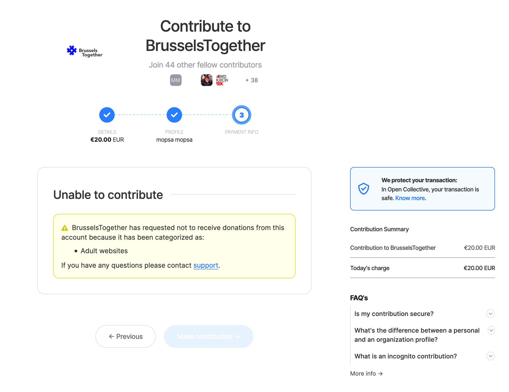

# Moderation

We understand it's important to have control over who can interact with your Collective and in what ways. Our Moderation features are an ongoing project, and we love to hear feedback from our community on what they would like to see next. You can also see what has been planned in our [Moderation project issue on Github](https://github.com/opencollective/opencollective/issues/3461).

## Rejecting financial contributions

If you would prefer to remove a sponsor from your Collective for any reason, you can now 'Reject' the contribution. This will:

* refund the financial contributor
* remove their membership from your Collective so that they are no longer listed as a sponsor
* and also let you send them a message telling them why you have rejected their contribution if you wish to do so


Collective admins can reject or refund financial contributions that are up to 30 days old. Admins of the fiscal host can reject or refund contributions older than this, although we don't recommend it.


Go to the _'Transactions'_ page for your Collective and click _'View details'_ on the transaction for the contribution you would like to reject. Click the button to reject it, and add a message if you want.

Click 'Yes, reject' and then the status of the transaction should update in your ledger to show the now rejected contribution, plus its refund transaction.


If an account continues to make contributions to your Collective after you have rejected them, this is against Open Collective's community guidelines. Please get in touch with [https://opencollective.com/support](https://opencollective.com/support) and we can block the account from interacting with your Collective.


## Rejecting categories of financial contributors

In addition to rejecting individual contributions, we also give you broader control over excluding contributions from certain categories of contributor.

Our current moderation/filtering categories are:

* Adult websites
* Casino/gambling websites
* SEO services
* VPN/proxy services
* Essay writing services
* Affiliate/review services

If you would like to prevent any contributions from accounts that have been categorized as one of these, you can set this up in your Collective menu under _'Policies'_.

You can select as many of the predefined moderation categories as you would like \(or none if you don't wish to filter the contributions you receive by category\).

Once you click _'Save'_, then the filtering categories will be applied to any financial contributions that are made to your Collective.

If a contributor's account has been tagged by the Open Collective team as belonging to one of the moderation categories, and your Collective has chosen not to receive contributions from this category, then they won't be able to contribute.

If you would like to let potential contributors to your Collective know upfront what your **contribution policy** is, and what kinds of contributions you may not accept, you can also do this in the _'Policies'_ section of the Collective menu. This will be displayed in the contribution flow as well.


It is against Open Collective's community guidelines and moderation policy for a contributor to create a new account to get around the category filter. If this happens, please report it to us on [https://opencollective.com/support](https://opencollective.com/support)


