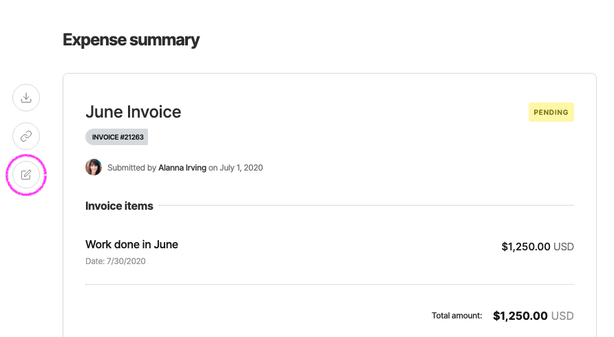

# Edit an Expense

If you have entered incorrect information on your expense you can click "edit" to fix it. Remember to save your changes.

Making changes to an approved expense means it will need to be approved again before it's paid.

The edit button is located to the top left of the expense.

