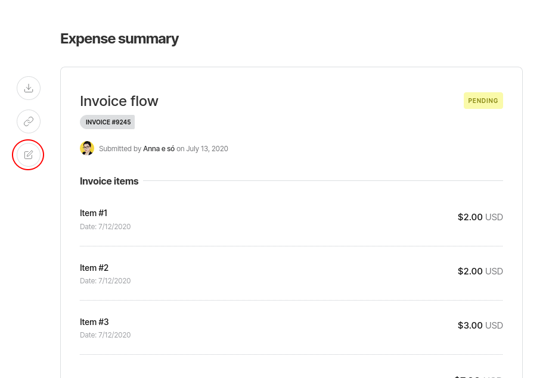
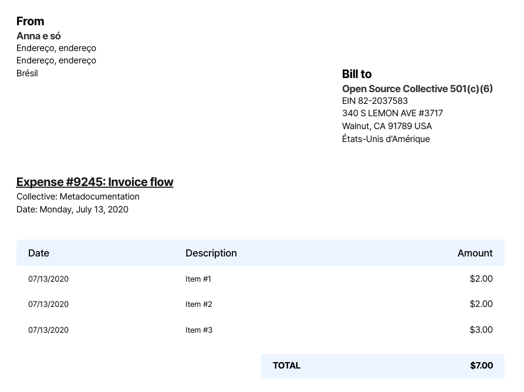

# Edit or Download an Expense

## Editing an expense


Making changes to an approved expense means it will need to be approved again before it's paid.


If you have entered incorrect information on your expense you can edit it to fix it. Remember to save your changes. To edit an expense, go to your profile and find the expense you want to edit on the **Transactions** section of your page.

Click on the **Edit** icon on the left to edit the details of a expense.

## Downloading an expense


Downloading an expense is only available for invoices.


You can also download an invoice you've submitted by clicking on the **Download** button on the left side of the expense description box.

Clicking on **Download** will generate a PDF with the metadata of the invoice:

