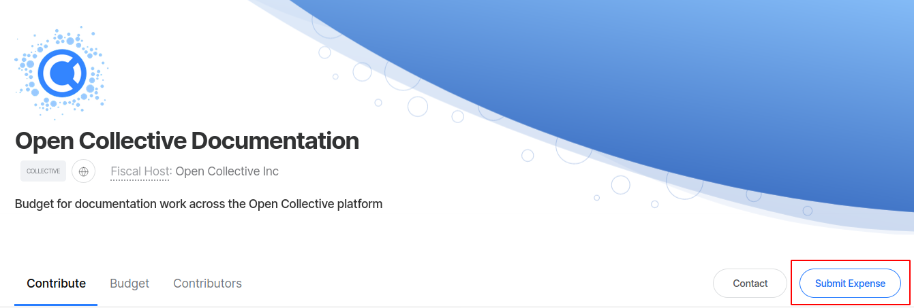
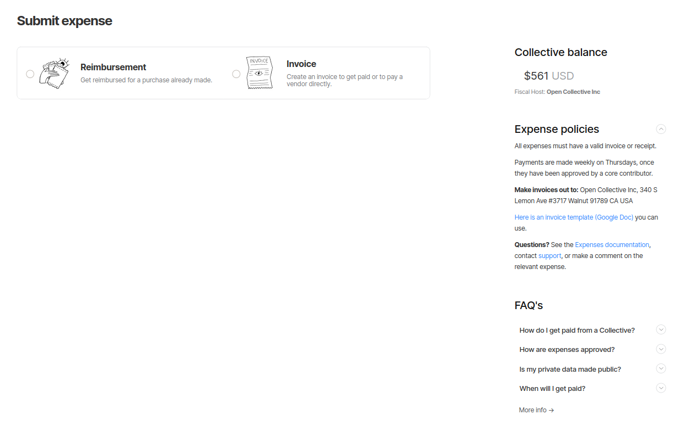
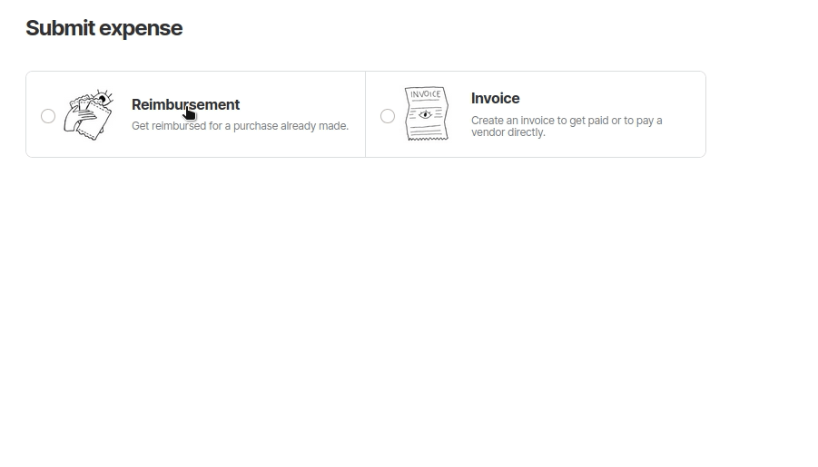
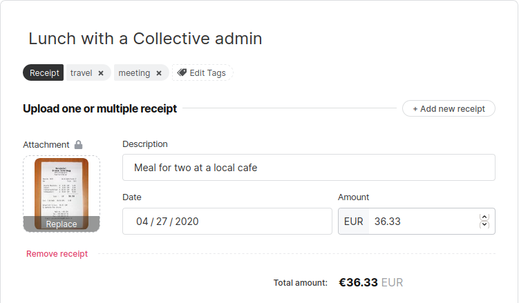
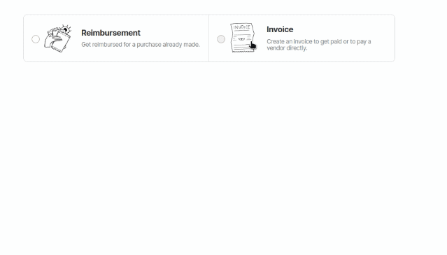
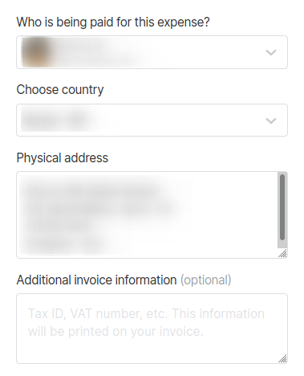

# Submitting Expenses

## To Submit an Expense

Go to the Collective you're submitting the expense to and click "Submit Expense".

On the **Submit expense** page, you can submit two types of expenses, **reimbursements** and **invoices.** On this page you can also check the **Collective balance**, review **expense policies** and get the answers to a few of the most frequently asked questions.

### Reimbursements

A **reimbursement** allows you to be reimbursed for a purchase you already made. To open the submission form, click on **Reimbursement** and add a title to your expense.

#### Adding receipts

Reimbursements must have receipts. Upload one or multiple receipts by dragging and dropping files or opening the file selector. Describe each item and add the date of purchase and amount spent.

A **valid receipt** contains:

1. Name of vendor \(person or company you paid\)  
2. Transaction date \(when you paid\)  
3. Detailed description of goods or services purchased \(what you bought\)  
4. Amount paid  
5. Form of payment \(cash, check, or last four digits of credit card\)

### Invoices


**Private information provided on invoices is not viewable publicly**. The expense amount and title will be listed on the Collective's public page, but attached files and payment details are only visible to admins.


An **invoice** allows you to be paid for your work, or to get funds in advance of a purchase. If you don't have a receipt for a reimbursement, you can submit an invoice instead.

To open the submission form, click on **Invoice** and add a title to your expense.

If you have an invoice ready, you can upload it as an attachment to the expense. However, you are still required to set invoice details such as description, date and amount. 

If you don't upload an invoice, the expense itself functions as an invoice for accounting purposes, as it contains all required information.

### Payment details

You can specify who will be paid for this expense \(an individual or an organization\) and which payment method you wish to use. 

If you are invoicing through a company, create an organization profile for your company and select it here instead of using your personal profile, so the correct entity is recorded as being paid for tax purposes.

Additionally, the invoice form will ask for your country, physical address, and give you the option to add more info.

The availability of certain options depend on which plan the organization adopts, and may include **PayPal**, **wire transfers**, or a **custom method**.

#### PayPal

To use **PayPal**, you can either select one of the saved PayPal accounts or add a new one by adding the email address registered in said account.

#### Wire transfers

You can either selected a saved bank account or add a new one. To add a new bank account

1. Select the currency in which you would like to receive your payment.
2. Fill all fields with the requested info, making sure to not use any acronyms. **All fields are mandatory**, and may vary depending on the selected currency.

Our bank transfers feature uses Transferwise and is only available in countries Transferwise serves.

#### Custom payment method

Add any relevant info necessary to complete the transaction.


In order to be paid, submitted expenses must be approved by a Collective admin, who ensures valid use of the Collective's funds. Then it proceeds to the fiscal host admin for processing.


### Expense summary

The Expense summary provides you an overview of the expense to be submitted, including attached files, items being paid for, payout preferences, etc. The summary allows you to review all info and quickly edit it if needed by clicking on **Edit expense**. 

For invoices, the expense summery serves as the official invoice document. You can download it for your accounting records if you wish.

You can also add a private note to the admins. Once your expense is ready, click on **Submit expense**.

