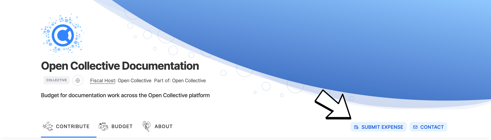
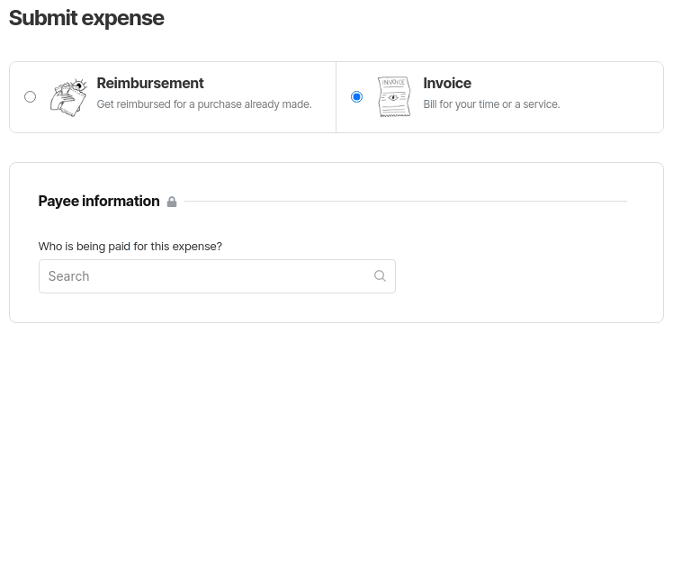
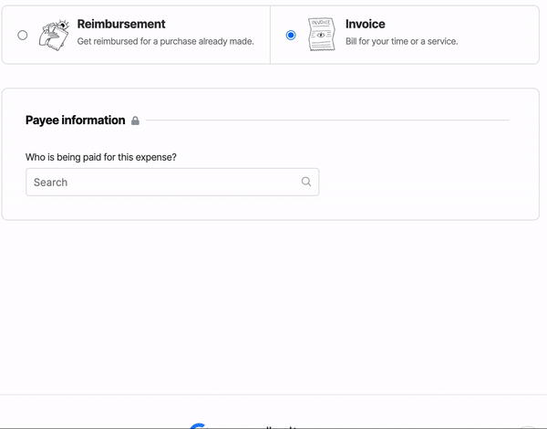
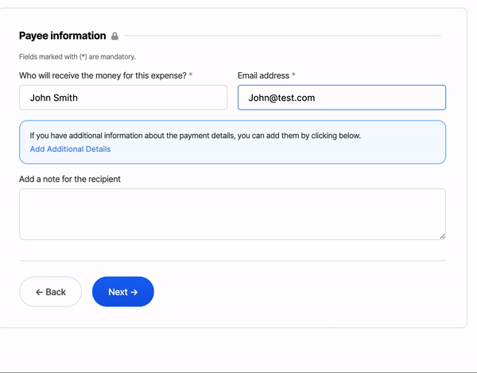

# Submitting Expenses

Go to the Collective you're submitting the expense to and click "Submit Expense".

On the **Submit expense** page, you can submit two types of expenses, **reimbursements** and **invoices.** On this page, you can also check the **Collective balance**, review **expense policies** and get the answers to a few of the most frequently asked questions.

### Payee information

In the first step, you can specify who will be paid for this expense \(an individual or an organization\) and which payment method you wish to use.

If you are invoicing through a company, create an organization profile for your company and select it here instead of using your personal profile, so the correct entity is recorded as being paid for tax purposes.

Additionally, the invoice form will ask for your country, physical address, and give you the option to add more info.

The availability of certain options depends on which plan the organization adopts, and may include **PayPal**, **wire transfers**, or a **custom method**.

#### PayPal

To use **PayPal**, you can either select one of the saved PayPal accounts or add a new one by adding the email address registered in said account.

#### Wire transfers

You can either select a saved bank account or add a new one. To add a new bank account:

1. Select the currency in which you would like to receive your payment.
2. Fill all fields with the requested info, making sure to not use any acronyms. **All fields are mandatory** and may vary depending on the selected currency.

Our bank transfer feature uses TransferWise and is only available in countries TransferWise serves. For an up-to-date list of countries, please refer [to their website](https://transferwise.com).

#### Custom payment method

Add any relevant info necessary to complete the transaction.


In order to be paid, submitted expenses must be approved by a Collective admin, who ensures valid use of the Collective's funds. Then it proceeds to the fiscal host admin for processing.


### Reimbursements

A **reimbursement** allows you to be reimbursed for a purchase you already made. To open the submission form, click on **Reimbursement** and add a title to your expense.

#### Adding receipts

Reimbursements must have receipts. Upload one or multiple receipts by dragging and dropping files or opening the file selector. Describe each item and add the date of purchase and amount spent.

A **valid receipt** contains:

1. Name of the vendor \(person or company you paid\)  
2. Transaction date \(when you paid\)  
3. A detailed description of goods or services purchased \(what you bought\)  
4. Amount paid  
5. Form of payment \(cash, check, or last four digits of the credit card\)

### Invoices


**Private information provided on invoices is not viewable publicly**. The expense amount and title will be listed on the Collective's public page, but the attached files and payment details are only visible to admins.


An **invoice** allows you to be paid for your work, or to get funds in advance of a purchase. If you don't have a receipt for a reimbursement, you can submit an invoice instead.

To open the submission form, click on **Invoice** and add a title to your expense.

If you have an invoice ready, you can upload it as an attachment to the expense. However, you are still required to set invoice details such as description, date and amount.

If you don't upload an invoice, the expense itself functions as an invoice for accounting purposes, as it contains all required information.

### Expense summary

The Expense summary provides you with an overview of the expense to be submitted, including attached files, items being paid for, payout preferences, etc. The summary allows you to review all info and quickly edit it if needed by clicking on **Edit expense**.

For invoices, the expense summary serves as the official invoice document. You can download it for your accounting records if you wish.

You can also add a private note to the admins. Once your expense is ready, click on **Submit expense**.

## Inviting a third-party to submit an Expense

It is also possible to draft an expense and send it to a third party to edit and submit an expense. You can send a drafted expense to an existing user of the platform or to someone else that is not on the platform yet.

Inviting a third-party user or organization to submit an expense automatically creates a draft of the expense and emails the user so they can finalise any final details and submit it to the collective.

Notice, although the invited user will pick who's going to be paid for the expense, the created expense will display you as the user who requested it:

### Inviting an existing user

To invite an existing user, search for an existing user in the payee selection dropdown. After selecting the user, you'll be able to add a title to the expense, optional items, and a note to the recipient that will be sent in the email.

The invited user will receive a notification by email containing a link with a key that will allow them to finish editing and submit the expense.

### Inviting a new user

It is also possible to invite a user that does not have an account on the platform to submit an expense. To do that, simply select the option _Invite someone to submit an expense,_ and inform their name and email:

You are now able to _add additional information about the expense._ Pre-fill whatever info you already have, then invite the payee to fill in the rest and confirm. This can make the whole process a lot easier!

If you're inviting an organization to submit the expense, don't worry, they'll be offered the option to create the company profile when they submit the expense.

When the user finishes editing the expense, the summary of the expense is displayed and they will be able to create their account and submit the expense in a single action:

After joining and submitting the edited expense, the expense now is saved in the platform and marked as _unverified_ until the users validate their email. After the user validates their email, the expense is marked as pending and is displayed for the collective's admins to approve, continuing its normal flow.

