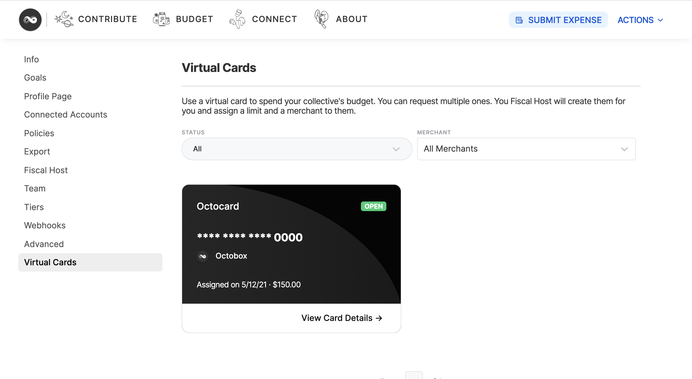

# Virtual Cards

Virtual cards are an additional benefit offered to collectives through hosts. Hosts create virtual cards and assign them to a Collective. Anyone with access to that card can then use it to make payments on behalf of the Collective. This is particularly useful for covering recurring costs like hosting a website.

## Requesting a card

Some Hosts accept requests for virtual cards. If you would like to request a Virtual Card select 'request card' from the 'action' menu on your collective's profile page.

## Using a virtual card

Virtual cards can be used to make purchases on behalf of your collective. Each card has an individual who is assigned the card for the purpose of filing expenses. Expenses are automatically created when the card is used and the assignee will be notified.

## Viewing card details

To view virtual cards associated with a collective select 'virtual cards' from the Collective Settings menu:

To view the details of a card click 'view card details'.

## Automatically Paused Cards

Hosts can choose to pause virtual cards if there are any incomplete expenses. This is a protective measure to prevent abuse. If your host has paused a card you will not be able to use the card to make purchases until a receipt has been attached to the previous expense by the assignee.


Be aware of your surroundings when viewing a card's details as others may be able to see them.


