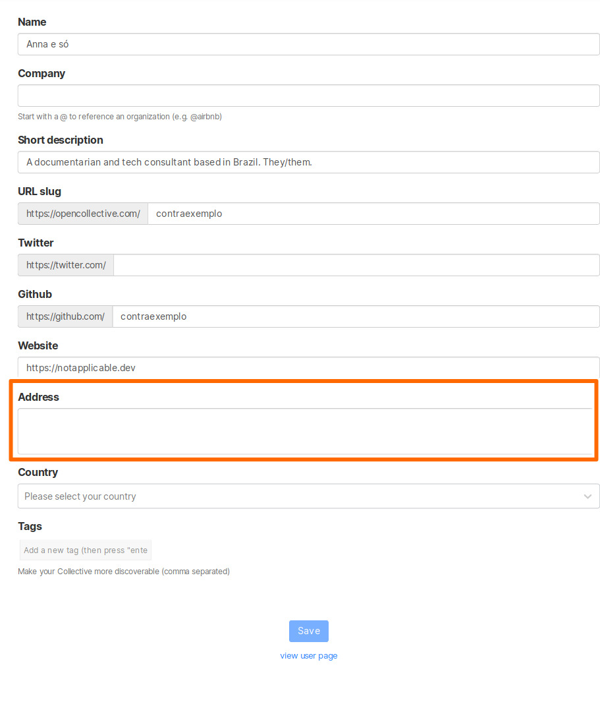
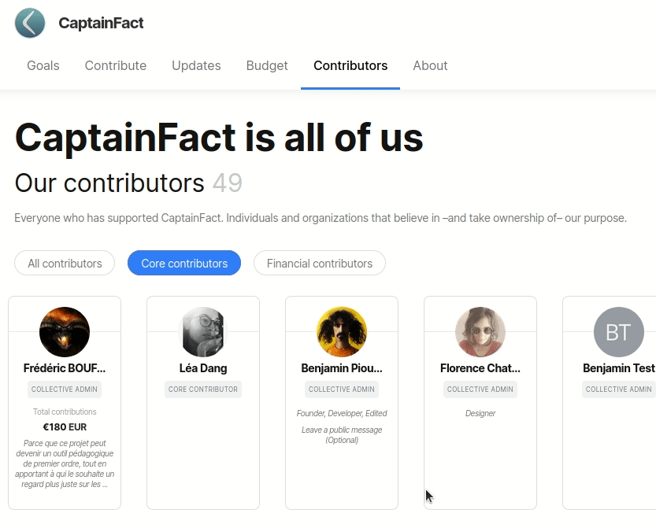

# FAQ

## Why should I give to a Collective?

If you get value out of what a project produces or stands for, support them to maintain and grow it. You can also get recognition by appearing on their page as a financial contributor.

## How do I contribute financially to a Collective?

Go to the Collective page of the project you want to support. Select a contribution tier and set up a recurring or one-time donation.

## How can I find Collectives to support?

Check out the [Discover](https://opencollective.com/discover) page or do a search.

You can also find open source dependencies using [Back Your Stack](https://backyourstack.com/).

## What payment methods can I use?

You can usually pay by credit card through a Collective's page. Some [Fiscal Hosts](../fiscal-hosts/fiscal-hosts.md) enable payments via bank transfer, Paypal, or other means for their Collectives, in addition or instead of credit card payments. When you go through the contribution flow, you'll see all the available payment methods for that Collective.

## Are my donations tax deductible?

It depends on the [Fiscal Host ](../fiscal-hosts/fiscal-hosts.md)of the Collective. If the host has tax-exempt status, then your donation can be tax deductible. It also may matter which country the host is in.

The Open Source Collective 501\(c\)\(6\) is a non-profit that serves as fiscal host to most open source software projects on Open Collective. Unfortunately, the IRS does not consider producing open source software to be a charitable activity in and of itself, and therefore does not grant tax exempt status. Donations to Collectives under Open Source Collective 501\(c\)\(6\) are not tax deductible.

In contrast, the Open Collective Foundation 501\(c\)\(3\), home to many groups focused on education, outreach, and social impact, does qualify for tax-exempt status. If you donate to a Collective under that host, it's tax deductible in the US.

## Can I update the billing address on my receipts?

Yes. To do so, go to your Profile and click on the gear icon next to your avatar. You will find an Address field on the first page:

## Can my Collective give to another Collective?

If both Collectives are in the same [Fiscal Host](../fiscal-hosts/fiscal-hosts.md), you can donate using the balance of a Collective. For example, most open source projects are hosted by the Open Source Collective, so they can give to each other.

To make a Collective-to-Collective donation, go to the page of the Collective and select your contribution amount. You will be given the option to donate from any Collective you are a core contributor of.

## Can I leave a message with my donation?

Yes, you will be given the option to write a note with your contribution on the "success" page.

If you want to add a public message to a past contribution, you can do so by going to the collective's page **Contributors** section. Inside your own card you'll see a link titled with `Leave a public message`.

