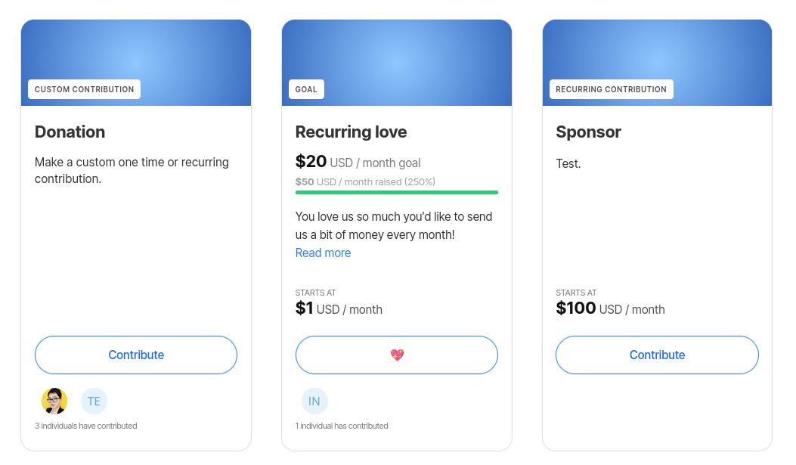
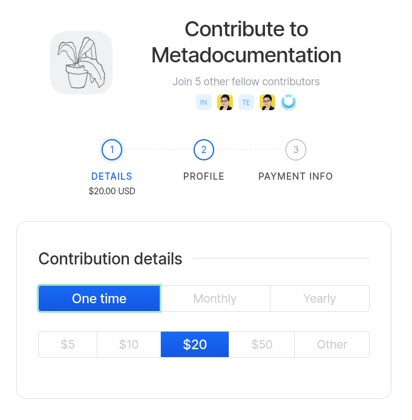
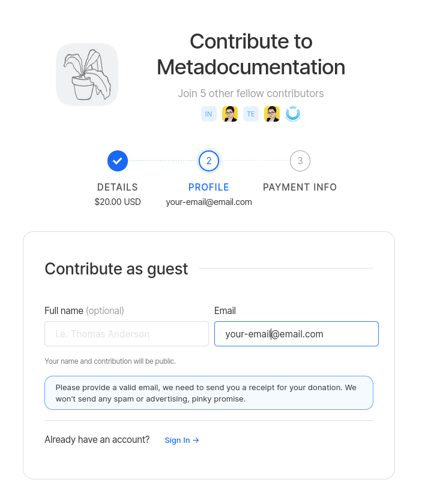
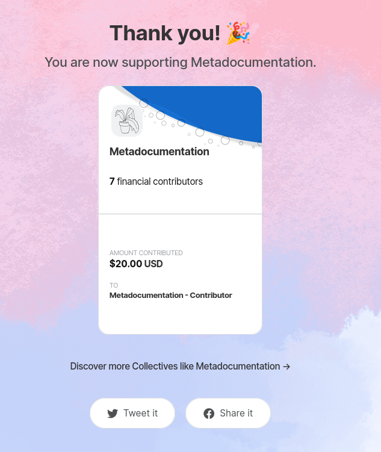

# Guest contributions

If you wish to stay anonymous for a specific contribution or don't want to create an Open Collective account, you can use guest contributions to make one time contributions to a Collective.


Recurring donations require an Open Collective account.


1. If you have an Open Collective account, make sure you are not logged in.
2. Go to the Collective's page and choose a form of contribution.

3. In **Contribution details**, make sure you choose **One time** and the amount you want to contribute.

4. In the **Profile** section, you'll be given an option to make a donation as guest or logged in your account. As a guest, **disclosing your name is optional**, but you need to provide an email address.

5. In **Payment info**, choose your preferred payment method and finish your contribution. You will receive a receipt about your donation soon after.

