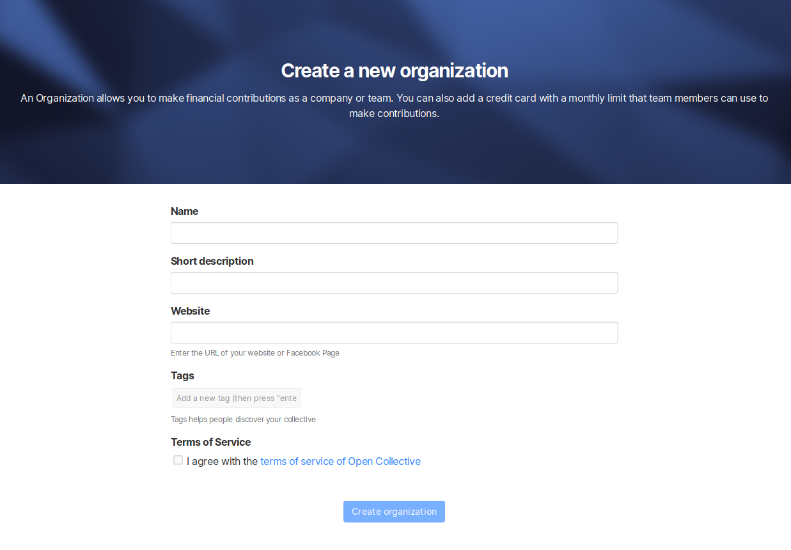

# Organizations

## What is an Organization?

An Organization is a profile that represents a company or entity instead of an individual. Companies that become Financial Contributors, as well as legal entities that are Fiscal Hosts, are Organizations on Open Collective.

## Why Create an Organization?

* Have your company show up as a Financial Contributor to Collectives
* Enable your employees to support Collectives on behalf of your company
* Make [bulk transfers](bulk-transfers.md) so you can send money once and distribute it to Collectives as you wish
* Become a Fiscal Host \([read more](../../fiscal-hosts/become-a-fiscal-host.md)\)

## **How to** Create an Organization

### **If you already have an individual profile**

Go to your profile menu \(top right\) and look for the My Organizations section. Click "**+"**. 

Once set up, you will be able to select your individual or organization profile when making a contribution.

### **If you don't have an individual profile yet**

Go through the process of contributing to a Collective, and you'll be able to create both the individual and organization profile during checkout.

## How to Edit an Organization

#### From your user menu

Use the cog icon next to the organization that you want to edit.

From there you can change your **Info**, add or remove **Team members**, create or edit your **Expenses Policy**, ****manage your **Payment Methods**, **Gift Cards**, **Connected Accounts**, **Webhooks** and to access **Advanced** settings.

Don't forget to **save your changes**!

## **How to access an Organization's contributions**

To access your Organization's contributions, go to the Organization's page and click on **Manage Contributions** in the navigation bar menu. From there you can access the action options to update amount or payment method, or cancel the contribution.


Sometimes, the **`Manage contributions`** button can  be nested inside the **Actions** menu


