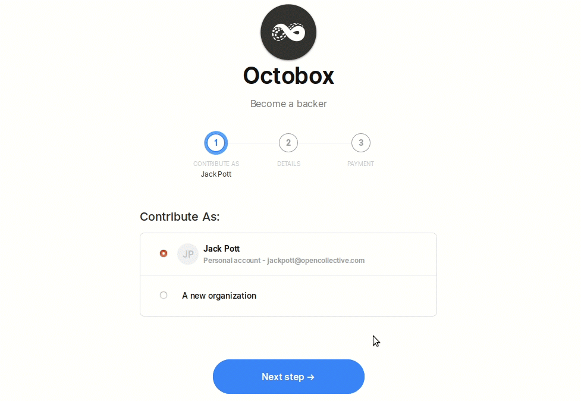
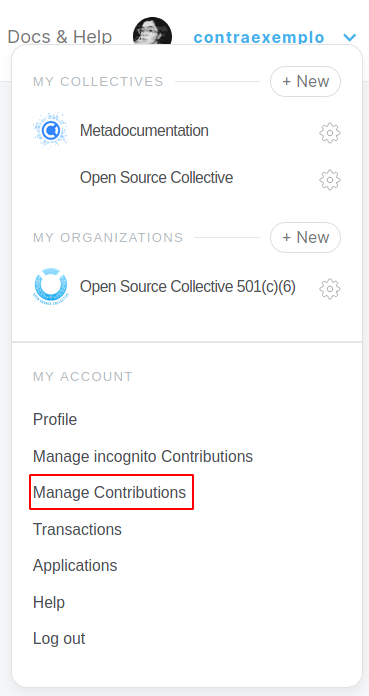

# Payments

## Financial contribution flow

## Payment options

#### Contribute as...

Select who you'd like to pay as—yourself as an individual, or an [Organization](organizations/) or [Collective](../collectives/collectives.md) you manage.

You can also contribute anonymously by making an incognito contribution. If you chose to contribute as "incognito", your financial contribution will not show up publicly linked to your profile. However, administrators can privately see which profiles are attached to incognito contributions.

#### Pay with...

1. Credit card - enter the details or use a saved card
2. [Gift card](organizations/gift-cards.md) - select the gift card you want to pay with
3. Collective - contribute [using the balance of one of your Collectives](collective-to-collective.md) \(if it's in the same host as the one you're donating to\)
4. [Organization](organizations/) - contribute using the balance saved to your Organization
5. Bank transfer, Paypal, or other method if made available by that Collective and their fiscal host

## Recurring financial contributions \(subscriptions\)

### Why do you charge recurring monthly subscriptions on 1st of every month?

It helps Collectives manage their monthly budget and is more predictable for them. We're working on a way to charge a single payment spread out across monthly contributions, to reduce payment processor transaction fees.

### When will I be billed next time?

You will be charged when you first contribute, and then on the 1st of each month \(for monthly contributions\) or the 1st of the same month next year \(for yearly contributions\). Note: To prevent you from being charged twice in a short time frame, if you contribute after the 15th of a given month, the next charge will not be the 1st of next month but the month after.

## Payment changes

To view your current payment methods, go to your profile \(under 'my account'\) and click 'edit profile', then 'payment methods'.

### Save a new credit card for future transactions

Go to manage payment methods in your profile settings and select "add another payment option". If you add a new card, you will have it as an option to make future contributions.

_**Note:** Adding a new card does not change the card for existing recurring contributions._

### Cancel a Recurring Contribution

If you have set up a repeating payment to a Collective, such as a monthly contribution, and you want to cancel it, here's how. Under your user menu, go to Subscriptions. Find the one you want to cancel and click the little three dot menu. Select 'cancel'.

### Change the amount or payment method for an existing contribution

Open the dropdown menu and click on **Manage Contributions**.

You'll be redirected to a page with all of your recurring financial contributions. Click on the three dots on the top right of a financial contribution card to update your payment method, amount or cancel your financial contribution.

When clicking on **Update payment method,** you'll be asked to type your new card details. Don't forget to hit **save**!

And if you click on **Update amount**, you'll be able to increase or decrease your financial contribution, but you won't be able to change its frequency.

