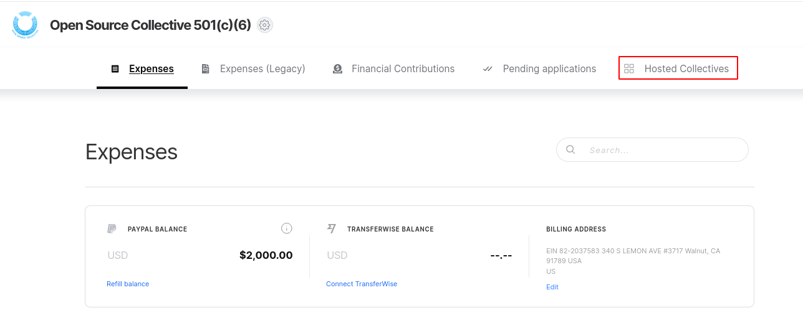
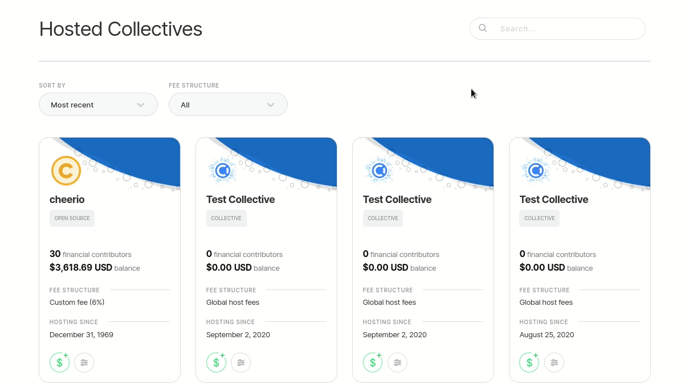
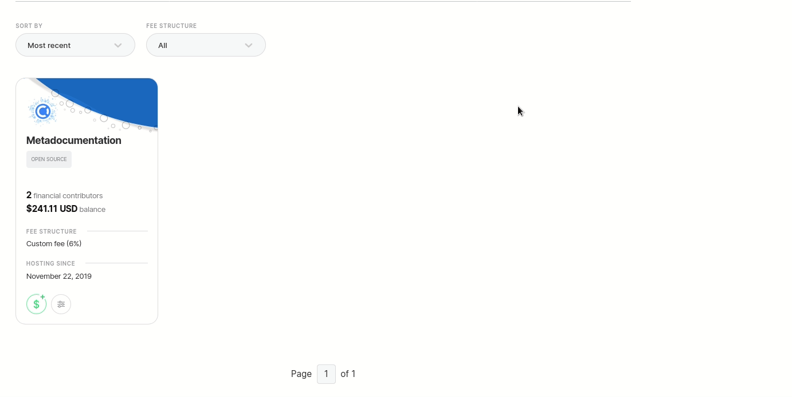
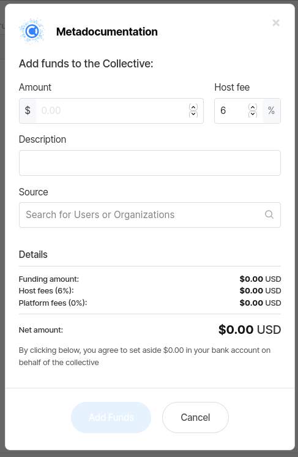

# Add Funds Manually


[In January of 2020](https://blog.opencollective.com/new-host-plans), we introduced new paid plans for Fiscal Hosts. Adding funds received through other channels is **free up to $1000 across Collectives** for Fiscal Hosts ****on the **Starter** plan. After you've reached that limit, you will need to upgrade your plan.


You can manually add funds to a Collective directly. This is useful when you receive a donation for a Collective outside the Open Collective system \(like a bank transfer\) and want to apply it to a Collective's budget.

Log in and go to your [Fiscal Host dashboard](fiscal-host-dashboard.md). Click on the **Hosted Collectives** tab.

 Use the search bar to find the Collective you want to add funds for.

Click on the **Add Funds** button.

And fill the form with all required information to add the funds to that Collective with the following information:

* The **amount** of funds you want to send to a Collective.
* Your **host fee**, which is the you charge your Collectives. It's already set to your default, but you change it to an one-time fee of your preference.
* A short **description** of those funds.
* The **source** of those funds. It can be your Fiscal Host, another Collective, or an Organization.

Once you're done, just click on **Add Funds**.

