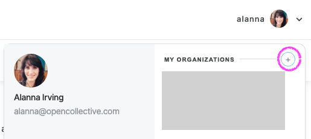
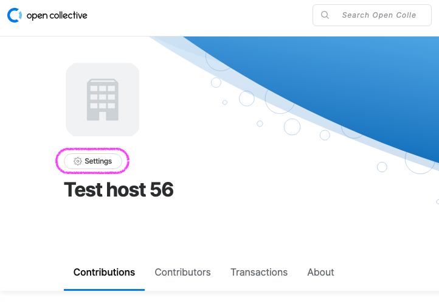
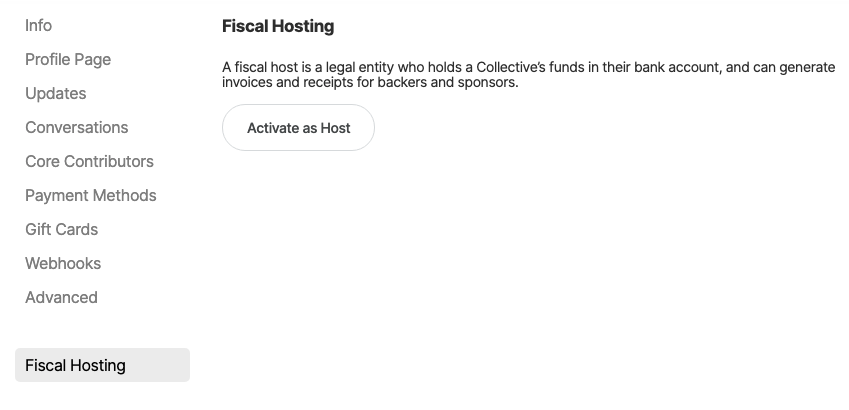
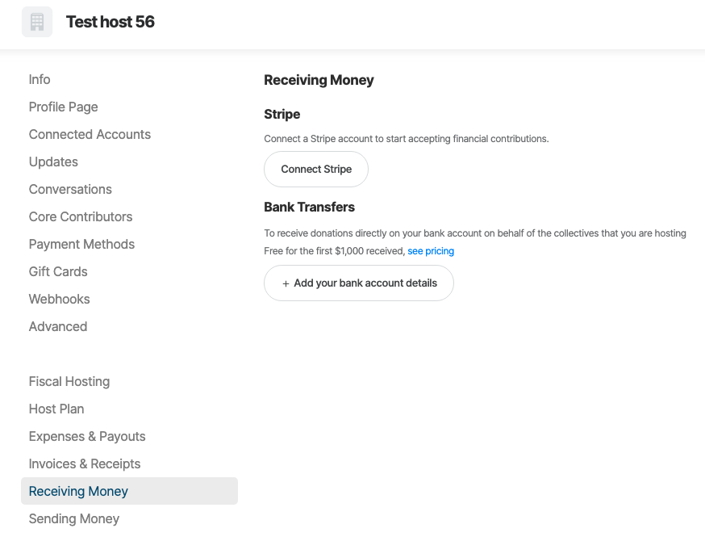
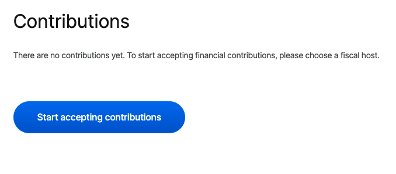
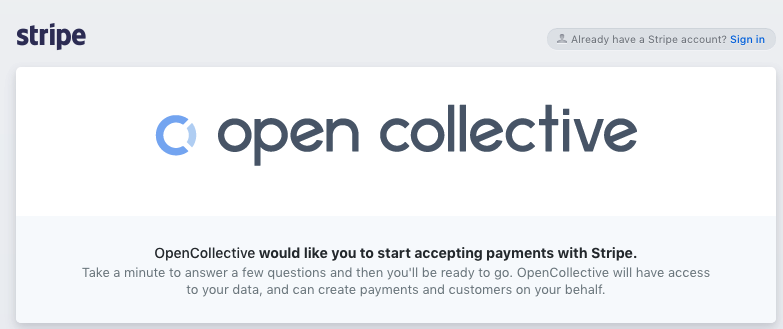

# Create a Fiscal Host

## Starting from scratch

**Go to** [**https://opencollective.com/create-account**](https://opencollective.com/create-account)\*\*\*\*

**Follow the steps to sign in to or create an Open Collective account**  
This is the account for the individual who is the host admin. So use your own name, not the organzation's name.

## To create only a fiscal host, without a Collective

**Create an Organization**

Open your user menu and click '+' next to 'My Organizations'.

Once your Organization is created, go to settings &gt; fiscal hosting and click 'Activate as Host'.

You will then see fiscal host settings, such as whether you want to be open to applications from Collectives, your host fee, etc.

**Go to 'Receiving Money'**

Activate a method for people to give money to your Collectives, either credit cards \(via Stripe\) and/or bank transfers.

## To create a Collective at the same time

**Create a Collective**  
This will be the page for the first project/group/budget you will be hosting. Open your user menu and click the + next to 'my Collectives'. Choose the 'for any community' option. \([Detailed instructions here](../collectives/create-collective.md)\)

**Add a host**

Either click the 'start accepting contributions' button on the Collective page, or go to settings : fiscal host.

**Select "use your own host"**

* **Type of host entity:** Select individual if you will be using your personal accounts, or select organization if you'll be representing a company or incorporated entity. 
* **Select an organization:** Choose "create organization" and enter the details.

**Activate your Stripe or Bank account**  
Click the "connect Stripe" button. Create a Stripe account, or log into your existing account by clicking "sign in" in the upper right corner. And/or input your bank account details to accept payments by bank transfer.

**Your host will now be active.**

## If you already have a Collective

Go to your Collective's page, click on the gear next to your logo, head to the Fiscal Host and select **Use your own host**. Follow the steps from there to create your host and connect your Stripe account.

## If you already have an Organization

If you want to create a Collective, follow the same steps as above, except instead of selecting "create organization", select the existing Organization you'd like to use from the drop down menu.

[**Next: customize your Fiscal Host and set the Fiscal Host fee.**](fiscal-host-settings/)

