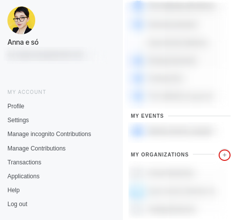
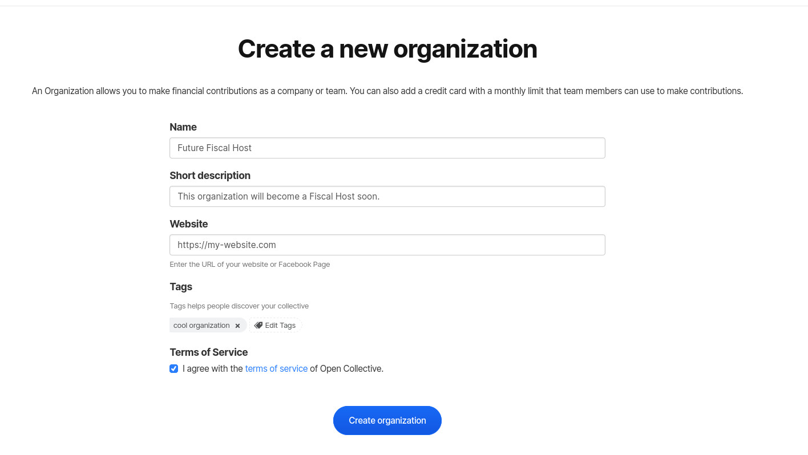
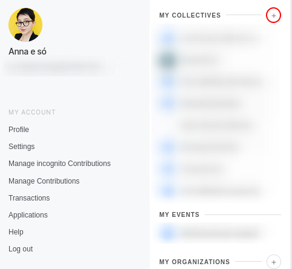
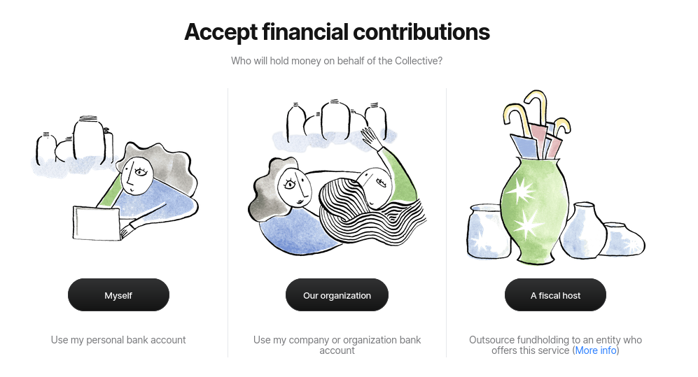
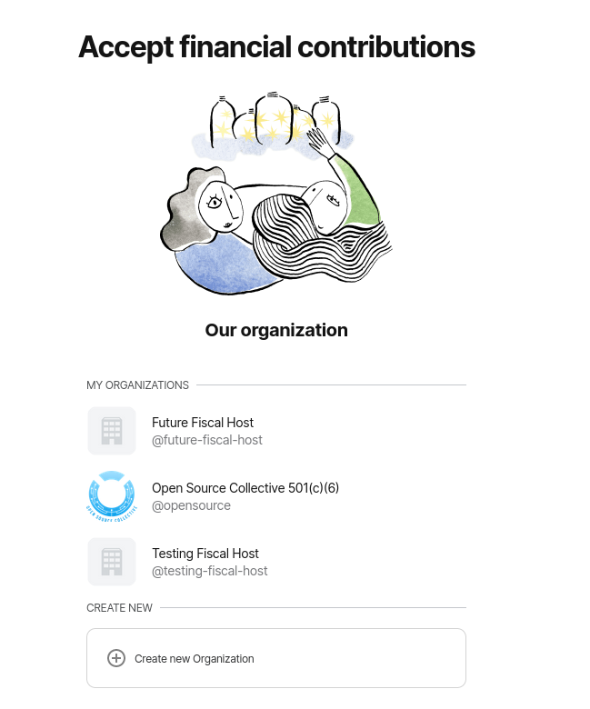
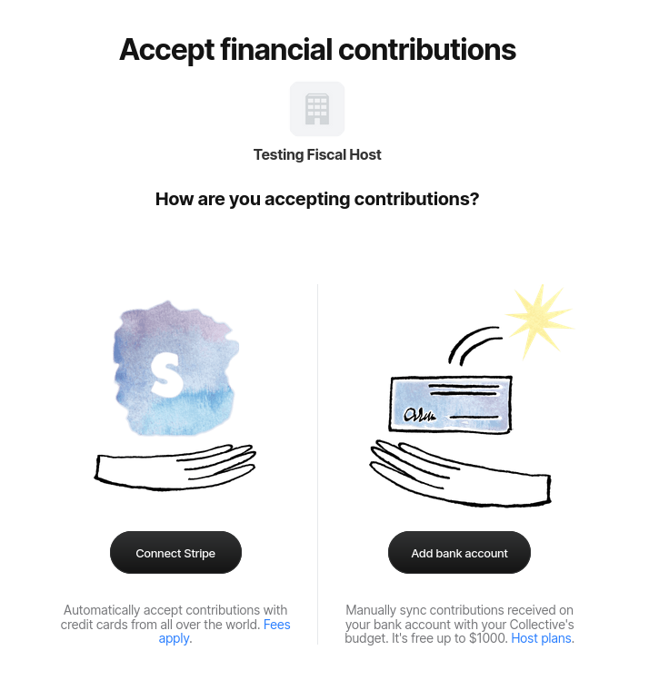
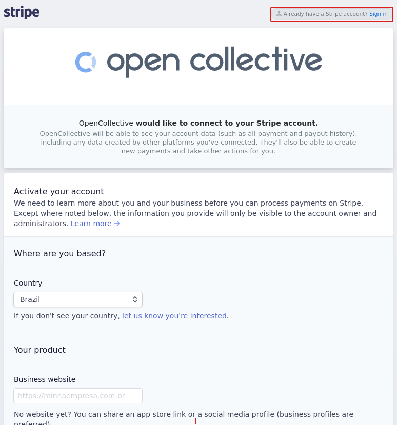
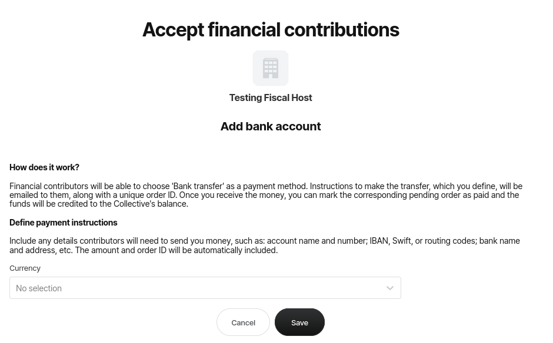

# Creating a Fiscal Host


If you don't have an account yet, please [create one](https://opencollective.com/create-account). You need an individual account to be able to create a Fiscal Host — so fill the form with the info of the **individual** **administrator** of that Fiscal Host.


## Check your starting point

The procedure to create a Fiscal Host depends on your starting point and your end goals. Click on the link that fits your case to get the appropriate instructions:

* [I don't have a Collective and I just want to create a Fiscal Host](create-a-fiscal-host.md#i-dont-have-a-collective-and-i-just-want-to-create-a-fiscal-host)
* [I already have an Organization and want to transform it into a Fiscal Host](create-a-fiscal-host.md#transforming-your-organization-into-a-fiscal-host)
* [I don't have a Collective or a Fiscal Host, and I want to create both](create-a-fiscal-host.md#i-dont-have-a-collective-or-a-fiscal-host-and-i-want-to-create-both)
* [I'm a new Collective and want to create a Fiscal Host](create-a-fiscal-host.md#add-a-fiscal-host)
* [I want to leave my current Fiscal Host and create one myself](../collectives/change-fiscal-host.md)

## I don't have a Collective and I just want to create a Fiscal Host

### Create an Organization


If you already have an Organization, you can skip this section and go to [Transforming your Organization into a Fiscal Host](create-a-fiscal-host.md#transforming-your-organization-into-a-fiscal-host).


Open your user menu and click on the **+** \(plus symbol\) next to the **My Organizations** section.

Give it a **name**, a **short description**, add its **website** address and a few **tags**.

### Transforming your Organization into a Fiscal Host

Once your Organization is created, go to **Settings** > **Fiscal Hosting** and click on **Activate as Host**.

You will then have access to all Fiscal host settings, such as whether you want to be open to applications from Collectives, your host fee, etc.

Don't forget to go to **Receiving Money** and activate a method for people to give money to your Collectives, either credit cards \(via Stripe\) and/or bank transfers.

## I don't have a Collective or a Fiscal Host, and I want to create both

### **Create a Collective**


If you already created a Collective and want to add a Fiscal Host of your own, go to [Add a Fiscal Host](create-a-fiscal-host.md#add-a-fiscal-host).


This will be the page for the first project, group or budget you will be hosting. Open your user menu and click the **+** next to **My Collectives**. 

When choosing what type of Collective you want to create, choose the **For any community option**.


If you need detailed instructions on how to create a Collective, please read our [Creating a Collective](../collectives/create-collective.md) page.


### **Add a Fiscal Host**

To add a Fiscal Host,  click on the **Start accepting contributions** button on your Collective page.

\*\*\*\*

When asked who will hold your money, choose **Our organization.**

You can either choose to add an existing Organization as a Fiscal Host or create a new Organization for that purpose.

### **Connect a Stripe account and/or add a bank account**

To receive financial contributions, you have to connect a **Stripe** account and/or add a **bank account**.

####  Connecting a Stripe account

1. Click on **Connect Stripe**. 
2. Create a Stripe account, or log into your existing account by clicking **Sign in** in the upper right corner. 

#### Adding a bank account

Choose a currency and add your bank account details to accept payments by bank transfer.

**Your Fiscal Host will now be active.**

[**Next: customize your Fiscal Host and set the Fiscal Host fee.**](fiscal-host-settings/)

