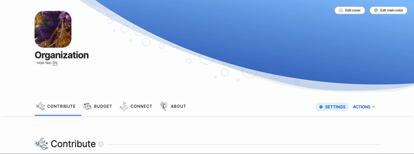
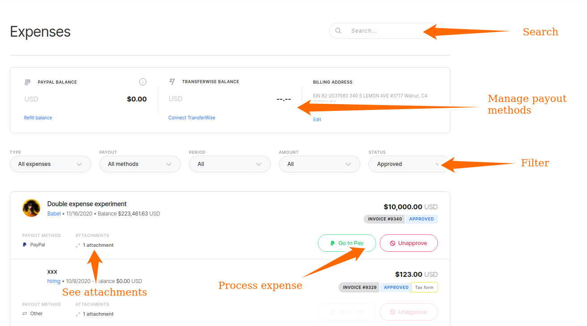
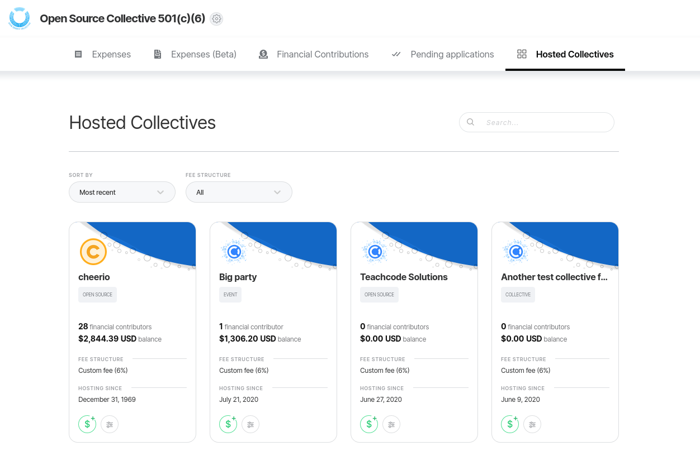

# Fiscal Host Dashboard

**The Fiscal Host Dashboard is your one-stop-shop for seeing all the information and completing your actions as host admin.**

## How do I get to the Host Dashboard?

Click the **Dashboard** button on your host page, while logged in as host admin. This button is nested inside the **Actions** menu.

## What can I do on the host dashboard?

### Expenses

**Filter**

* **Pending:** expense has been submitted but not yet approved by the Collective's core contributors
* **Approved:** Core Contributor has confirmed this expense is good to payout
* **Paid:** past expenses already complete

#### Pay with PayPal

Green button showing that an expense has been approved and there are sufficient funds. If you click this button, the expense will automatically be paid from the connected PayPal account.

#### Mark as Paid

Green button for manual payments. After paying via another method \(bank transfer, etc\), click this to deduct the amount for the Collective's budget in the system.

#### Edit

Host admins have permission to edit expenses at any time. For example, someone wasn't able to attach their receipt and emailed it instead, and you are adding it for them.

**Note:** If you edit an expense, it must be re-approved.

#### Open Expense

If you click the title of an individual expense, you will go to that expense's page. There, you can see all details and read or add [comments](../expenses-and-getting-paid/expense-comments.md).

#### Connect PayPal & refill balance

PayPal allows you to pre-approve $2,000 at a time to be paid through the API. This is a security feature. This means after you've paid out $2,000 in expenses, you need to refill the balance. If you try to pay an expense and get an error about the PayPal balance, it's time to refill.

When you click "refill balance" you will be prompted to log in to PayPal, and afterwards you'll be taken back to your dashboard.

You can see the connected PayPal account in the top right. This is the account expenses will be paid out of.

If you manage multiple PayPal accounts, make sure it's the right one! If it's not correct, open PayPal in another tab and manually log out, then click "refill balance" and use credentials for the right account.

#### Payment Error Troubleshooting

Payment errors will show in red next to the expense if they come up.

Common reasons for a payment to fail after clicking the "Pay with PayPal" button:

* Need to refill the pre-approval balance
  * Click the 'refill balance' button
* Insufficient funds to cover fees
  * There are not enough funds in the Collective to pay this expense. Many Collectives submit expenses in anticipation of future funding.
  * If a user submits an expense for 100% of the Collective's balance, there won't be enough to cover processing fees
  * Edit the expense total down to leave enough for the fees and inform the user by leaving a comment
* User's PayPal account is restricted
  * Ask the user to log into PayPal and resolve the issue on their side

### Manage hosted Collectives and set custom fees

You can access a list of all your hosted Collectives by clicking on the **Hosted Collectives** tab. With the first dropdown menu, you can sort them by the period of time you've hosted them from the most recent to oldest and oldest to most recent. You can also filter them by fee structure: by **global host fee** or **custom fee**.

To add a custom fee to a specific Collective, either find them listed on the page or look for them by name on the search bar. Once you find the right Collective, click on the **Fee structure** button \(the one with a set of lines\).

You will be prompted to either choose your global fee structure or to create a custom fee for this specific Collective. Don't forget to save your changes!

### Pending applications


This section needs additional documentation. You can contribute by editing this document on [https://github.com/opencollective/documentation/blob/v2/fiscal-hosts/fiscal-host-dashboard.md](https://github.com/opencollective/documentation/blob/v2/fiscal-hosts/fiscal-host-dashboard.md).


### Financial contributions

Shows all incoming contributions.

