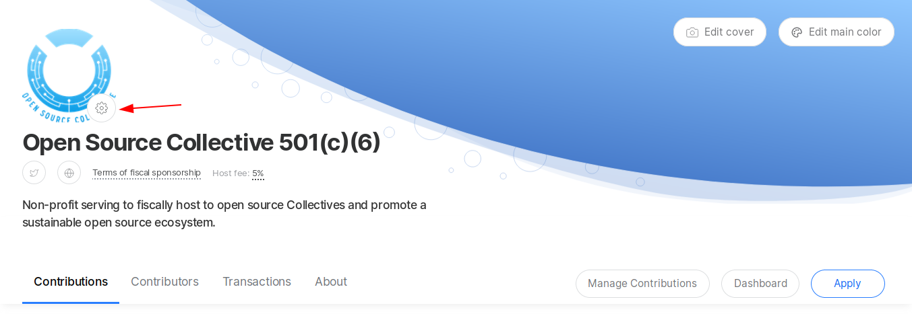
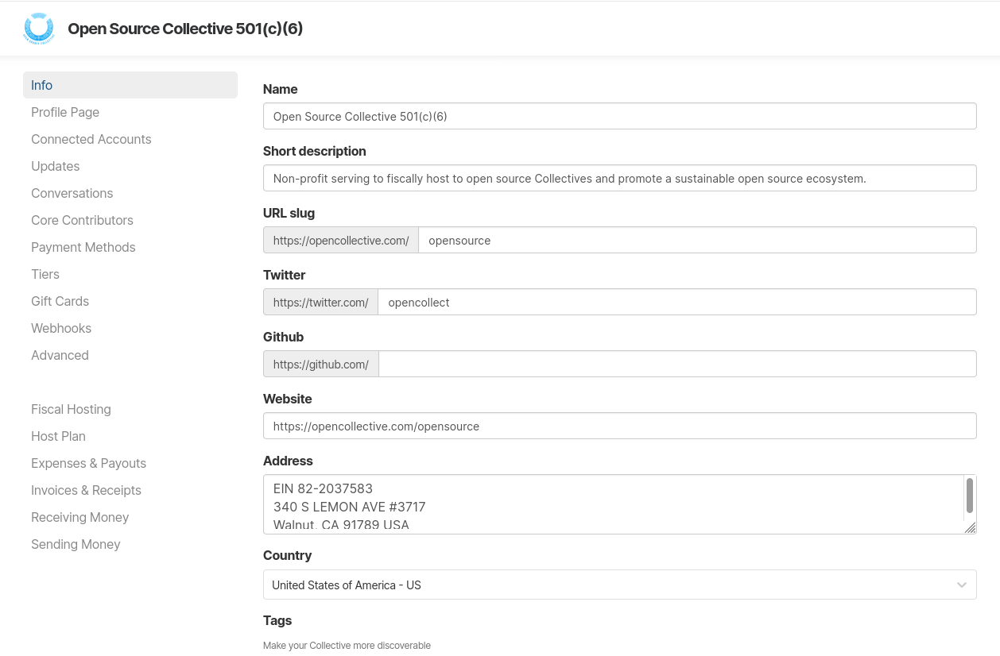

# Fiscal Host Settings

Go to your Fiscal Host page and click on the gear next to your logo to reveal the different settings and options for your Fiscal Host.

Here's an overview of all settings available for Fiscal Hosts:

### Add more information about your Fiscal Host



### Control the visibility and order of sections of your profile page



### Connect external accounts



### Manage updates



