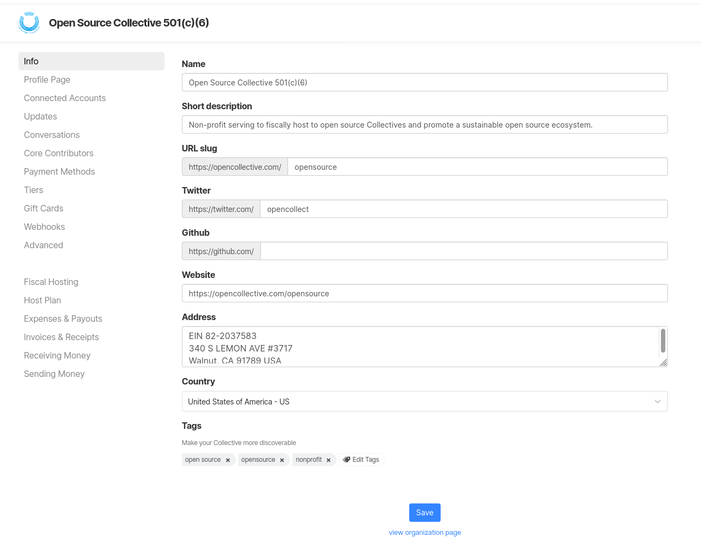

# Add more info

In this section of your settings, you can:

* Edit your Fiscal Host name
* Add a short description about your Fiscal Host
* Control your URL slug
* Add links to your Twitter and GitHub profiles
* Add your website
* Specify your address and country
* Add tags to make your Fiscal Host more discoverable

