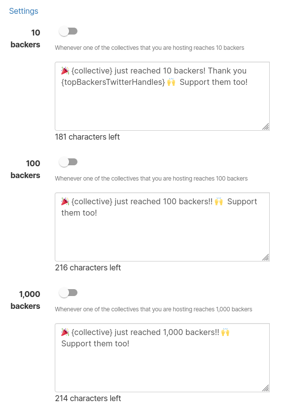

# Connect external accounts

## Connecting a Twitter account

Click on **Connect Twitter**. You will be prompted to either directly authorize Open Collective to access your account or to log in and authorize it.

Connecting your account will provide you a few automation options based on how many financial contributors Collectives you host have reached:

