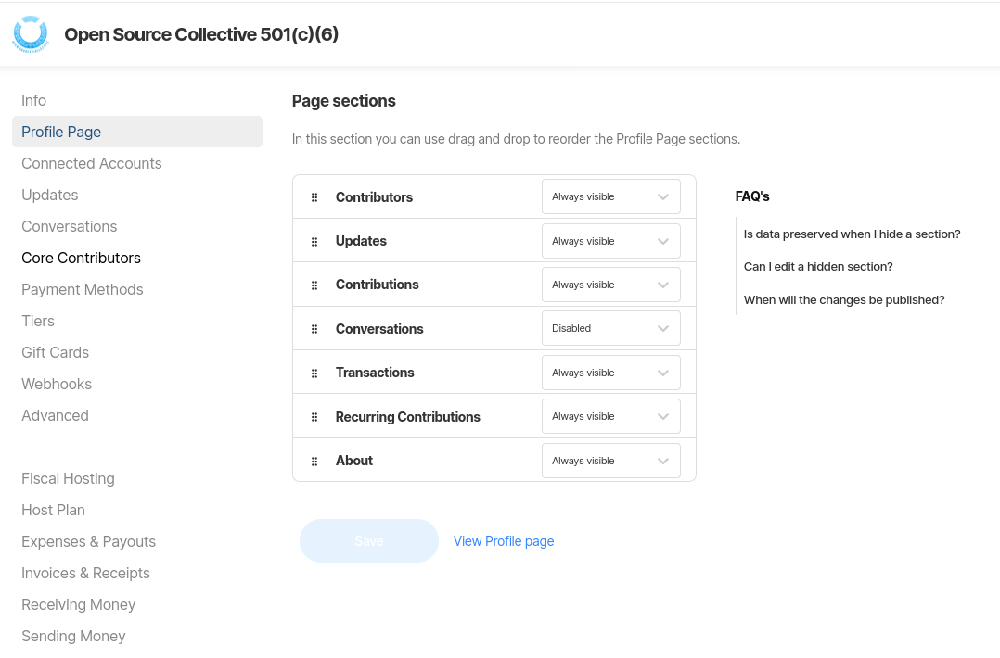
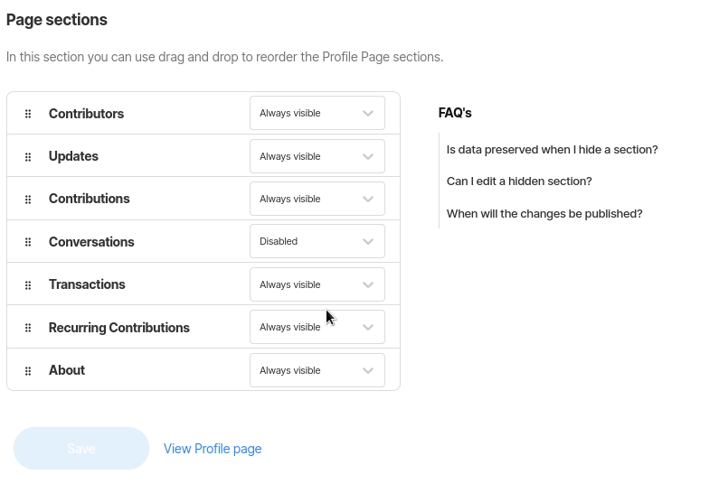
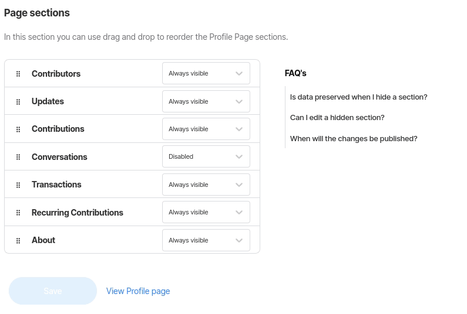

# Customize page sections

In this section, you can control the visibility and the order of all sections of your profile page.

To change the visibility of a specific section, use the dropdown menu to change its state to either **Always visible** or **Disabled**.


Your data is preserved when you hide a section and you'll be able to re-enable it whenever you want. If hidden, the section will be hidden for everyone — including you — and you will not be able to edit it.


To change the order each section is displayed, drag and drop a certain section to the desired position.

Don't forget to save in order to apply any changes!

