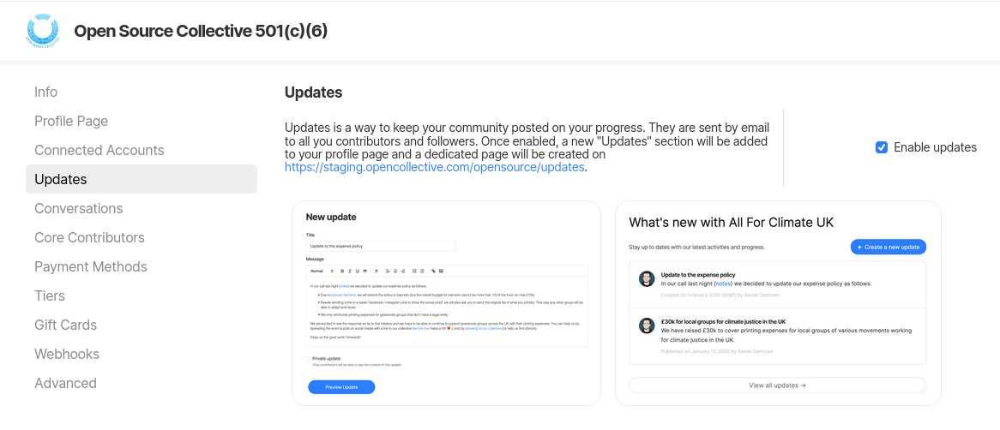

# Manage updates

Updates is a way to keep your community posted on your progress. They are sent by email to all you contributors and followers. In this section, you can either activate or deactivate updates by clicking on the checkbox.

