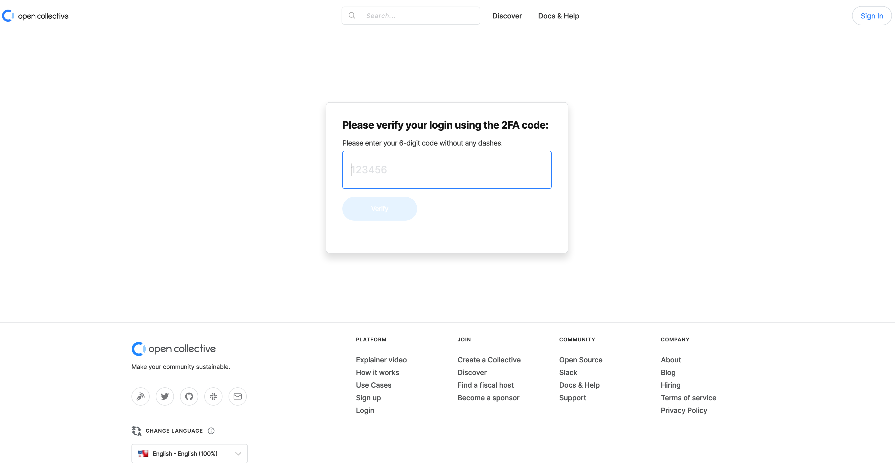
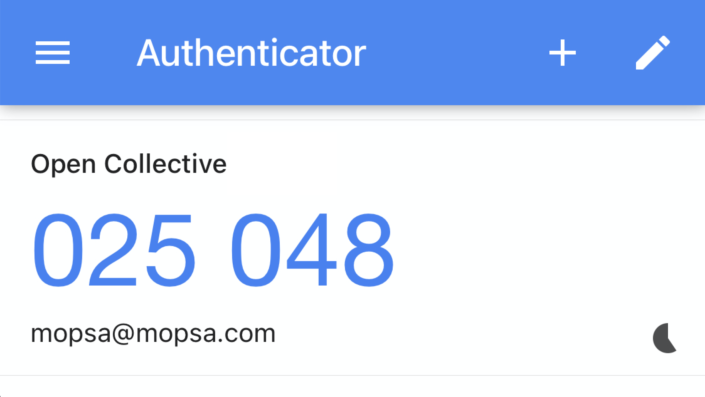

# Two-factor authentication for payouts

Fiscal hosts now have the ability to enable two-factor authentication on payouts. This means that when you go to the host dashboard and click “Go to pay” to open the payment modal, you will sometimes be prompted to enter a 2FA code as an extra layer of security.

## Enabling 2FA for login

First, you need to enable two-factor authentication on your user account. You can do this from your profile settings menu.

You’ll need an app on your phone like Google Authenticator, Authy, or any other authenticator that can scan the QR code and give you a 6-digit 2FA code in return. You then type the code into the input field, and click "Verify". 


Once you’ve set up 2FA on your account, it’s really important to not delete the entry for Open Collective in your authenticator app.


When you have 2FA enabled on your account, you will be prompted to enter a 6-digit code whenever you click the [one-time login link](https://docs.opencollective.com/help/product/log-in-system) we email to you.

## Enabling 2FA for payouts

Now you’re ready to make payouts from the host dashboard. Click “Go to pay” for the first expense.

The payment modal will then open, giving you the option to pay out for the expense.

For the first expense that you’re paying in a “session”, you will be prompted to enter your 2FA code. Open your authenticator app and enter the 6-digit code that is under the entry for your account on Open Collective. 

Then click the pay button in the modal again. If the code is correct, then the payment should go through.

What happens now that you have “authenticated” by putting in your 2FA code is that you are allowed to make any number of payments until the sum of their amounts add up to a limit \(which defaults to $10,000.00\). When the sum of the amounts of all the payments you’ve made goes over the limit, you are then asked to enter your 2FA code again in order to keep making payments.

If you and another admin/accountant for your organization are making payments at the same time, you each get your own limit instead of working against a shared one.


When you enable 2FA for payouts on your organization, every admin or accountant who makes payments will need to enable 2FA for login on their individual accounts, so please make sure to let them know this before enabling it.


