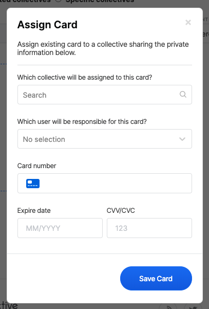
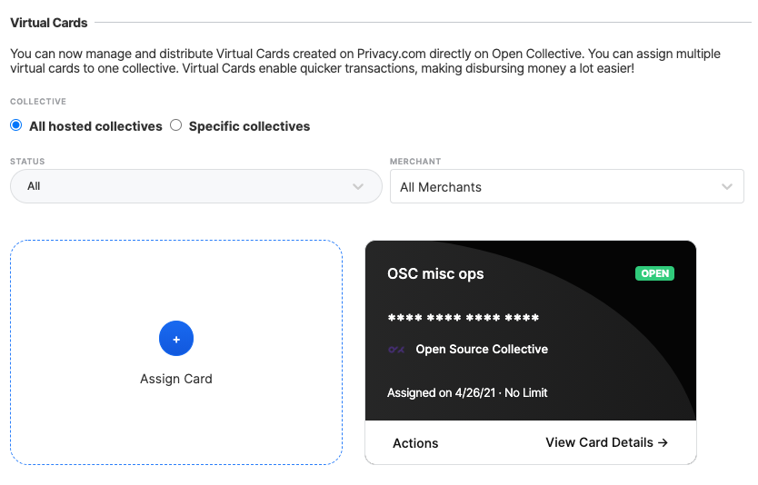
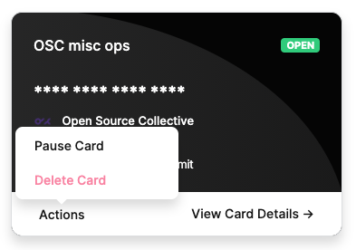

# Virtual Card Settings

Virtual cards can be offered to collectives through Hosts. Hosts create virtual cards using our provider [Privacy.com](https://privacy.com/) and assign them to a Collective. Anyone with access to that card can then use it to make payments on behalf of the Collective. When a payment is made an expense is automatically created for the Collective and the owner is notified to attach a receipt. Virtual Cards are particularly useful for recurring payments like hosting a website.

## Accessing Virtual Card Settings

To access your virtual card settings and policy select 'Virtual Cards' from your host profile settings page:

## Setting a policy

Hosts have complete control over when, how and to who they provide Virtual Cards. Hosts can define their own policy in the 'Virtual Card Policy Information' area.

## Automatically pausing and resuming virtual cards

Toggle the 'automatically pause and resume cards' option to automatically pause virtual cards if there are any incomplete expenses. If a card has been paused Collectives will not be able to use the card to make purchases until a receipt has been attached to the previous expense by the assignee. This is a protective measure to prevent abuse.

## Enabling users to request virtual cards

It is possible to create and assign virtual cards to Collectives without enabling users to request them. Toggle the 'allow collectives to request a card' option to allow Collectives to request a card. Collectives can request a Virtual Card by clicking 'Request a card' from their

## Creating and assigning cards

Virtual Cards are created using our provider [Privacy.com](https://privacy.com/). To create a card on [Privacy.com](https://privacy.com/) register and follow the details [here](https://privacy.com/virtual-card).

Once you have created a card on [Privacy.com](https://privacy.com/) you can assign it to a Collective:

Select a Collective then select a user who is responsible for this card. This user will be automatically added to expenses created when a purchase is made using this card and they will be notified and asked to provide an receipt.

Click 'Save Card' to save the card to the Collective.

## Viewing Card details

You can view all cards assigned to Collectives from the Virtual Cards settings page. Here you can filter cards by status, merchant and Collective.

Each card shows the name, status, assigned collective, when the card was assigned and any limits set on the card in Privacy.com. The last four digits of the card are also shown. To view the full details of a card click 'view card details'.


Be aware of your surroundings when viewing a card's details as others may be able to see them.


## Changing virtual card spending limits, owners and collectives

Virtual Card spending limits can be modified using Privacy.com. We do not provide facilities for moving cards between Users or Collectives. This ensures that we have clear records for Collectives with clear responsibilities. If you need to re-assign a card, delete the card then create and assign a new one instead.

If you need to make a change to initiative's card, please update to the correct amount in Privacy.com, and then contact us at [https://opencollective.com/support](https://opencollective.com/support) with a screenshot so that our team can make the adjustment on the platform.

## Pausing, resuming and deleting a card

To pause a card select 'pause card' from the actions menu from the virtual cards page. Paused cards cannot be used to make payments, any recurring payments will also be paused. To resume a card select 'Unpause card' from the actions menu. To remove a card from the collective select 'Delete card' from the Actions menu.

