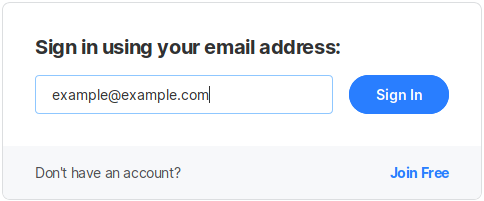
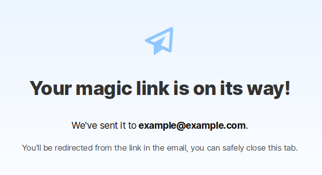

# Log-in System

Open Collective works with a **no-password system,** because our users appreciate not having to remember another password, especially when on mobile.

### **How it works**

You type in your email and the system instantly knows if you're an existing user or a new user.

If you already have an account, we send you an email with a unique link that logs you into Open Collective. You will stay logged in for 30 days on that device.

If you're a new user, you'll be prompted to create an account.

## About security

According to [Auth0](https://auth0.com/blog/is-passwordless-authentication-more-secure-than-passwords/): 

> Passwordless authentication, by its nature, eliminates the problem of using an unsafe password. This means that one of the biggest user errors is taken out of your login. Not only is passwordless authentication safe to use, it might even be safer than a traditional username + password login.

Not only this mechanism is safe, but it's also covered by our [security bounty policy](https://github.com/opencollective/opencollective/blob/master/BOUNTY.md) ; we invite security researchers \(and pay them\) to try to break our system and improve it.

We are currently implementing 2FA \(two factors authentication\) which will bring an important layer of security on top of that.

